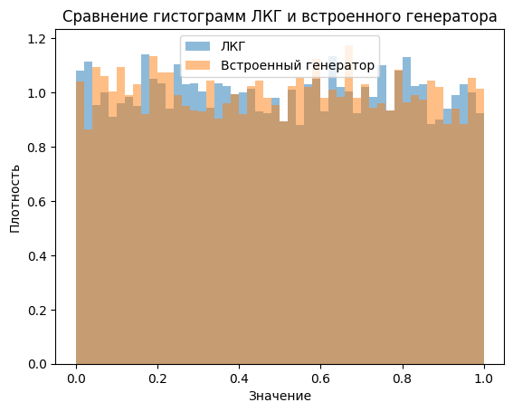

# Linear-congruential-generator
Задание №2. Генераторы псевдослучайных чисел по предмету "Моделирование систем"

## Общее описание алгоритма ГПСЧ и его реализации
**Линейный конгруэнтный генератор (ЛКГ)** — это простой и широко используемый алгоритм для генерации псевдослучайных чисел. Он основан на рекуррентной формуле:

$$
X_{n+1} = (aX_n + c) \mod m
$$

где:

- $X_n$ — текущее значение последовательности,
- $a$ — множитель,
- $c$ — приращение,
- $m$ — модуль.

При правильном выборе параметров $a$, $ c$ и $ m$ ЛКГ способен генерировать последовательности с максимальным периодом и удовлетворительными статистическими свойствами, приближенными к равномерному распределению.

В реализации данного алгоритма на Python был создан класс `LCG`, который инкапсулирует всю логику генератора. Класс инициализируется заданными параметрами и начальным значением (seed). Он предоставляет методы для генерации следующего числа в последовательности и для получения списка псевдослучайных чисел заданной длины. Реализация включает проверки корректности параметров и обеспечивает нормализацию выходных значений в диапазон $[0, 1)$ для удобства использования в различных приложениях и дальнейших статистических тестах.


## Краткое изложение идеи выбранных методов тестирования
### Построение гистограмм

**Идея метода:** Гистограмма — это графическое представление распределения данных, которое разбивает диапазон значений на интервалы (бины) и отображает количество или плотность наблюдений в каждом бине. Построение гистограмм для последовательностей, сгенерированных ЛКГ и встроенным генератором, позволяет визуально оценить, насколько равномерно распределены полученные числа по заданному диапазону. Сравнивая гистограммы двух генераторов, можно выявить возможные отклонения от равномерного распределения и различия в качестве генерации случайных чисел.

### Тест Колмогорова-Смирнова

**Идея метода:** Тест Колмогорова-Смирнова (К-С тест) — это непараметрический статистический тест, используемый для проверки соответствия эмпирического распределения выборки теоретическому распределению или для сравнения двух эмпирических распределений. В данном случае К-С тест применяется для оценки того, насколько последовательности чисел, сгенерированные ЛКГ и встроенным генератором, соответствуют теоретическому равномерному распределению. Тест вычисляет максимальное отклонение между эмпирической функцией распределения выборки и кумулятивной функцией равномерного распределения, что позволяет количественно оценить соответствие и сделать выводы о статистической значимости отклонений.

### Тест на автокорреляцию

**Идея метода:** Тест на автокорреляцию предназначен для выявления зависимости между последовательными значениями в серии данных. В контексте генераторов случайных чисел важно, чтобы последовательные значения были независимы. Автокорреляция измеряет степень линейной зависимости между значениями серии с заданным лагом (интервалом). Вычисляя коэффициент автокорреляции для последовательностей, сгенерированных ЛКГ и встроенным генератором, можно определить, присутствует ли статистически значимая зависимость между значениями, что указывает на потенциальные проблемы с независимостью генератора.


## Результаты тестирования


### Построение гистограмм

**Визуализация:**



**Объяснение:**

На гистограмме представлены распределения последовательностей чисел, сгенерированных линейным конгруэнтным генератором (ЛКГ) и встроенным генератором Python (`random.uniform(0, 1)`). Обе гистограммы построены с использованием 50 бинов и нормированы по плотности.

- **ЛКГ:** Распределение выглядит достаточно равномерным, высота столбцов гистограммы примерно одинаковая по всему диапазону $[0, 1)$.
- **Встроенный генератор:** Также демонстрирует равномерное распределение, сопоставимое с результатами ЛКГ.

**Вывод:**

Визуальное сравнение гистограмм не выявляет существенных отличий между двумя генераторами. Оба генератора, по всей видимости, успешно генерируют числа, распределенные равномерно на интервале $[0, 1)$.

### Тест Колмогорова-Смирнова

**Выполненные вычисления:**

Для обеих последовательностей чисел был проведен тест Колмогорова-Смирнова (К-С тест) с помощью функции `kstest` из библиотеки `scipy.stats`. Тест сравнивает эмпирическое распределение с теоретическим равномерным распределением на интервале $[0, 1)$.

**Результаты:**

- **Для ЛКГ:**

  ```
  ЛКГ KS Статистика: 0.00787, p-value: 0.56199
  ```

- **Для встроенного генератора:**

  ```
  Встроенный генератор KS Статистика: 0.00819, p-value: 0.51113
  ```

**Объяснение:**

- **KS Статистика:** Показатель максимального отклонения между эмпирической и теоретической функциями распределения.
- **p-value:** Вероятность получить такое или большее отклонение при условии, что нулевая гипотеза верна (данные действительно распределены равномерно).

**Интерпретация:**

- **Для ЛКГ:**
  - KS статистика составляет 0.00787, p-value равно 0.56199.
  - **Вывод:** p-value значительно больше 0.05; нет оснований отвергать нулевую гипотезу. Последовательность ЛКГ соответствует равномерному распределению.

- **Для встроенного генератора:**
  - KS статистика составляет 0.00819, p-value равно 0.51113.
  - **Вывод:** p-value также больше 0.05; встроенный генератор соответствует равномерному распределению.

**Заключение:**

Оба генератора успешно прошли тест Колмогорова-Смирнова, подтверждая, что они генерируют числа, распределенные равномерно на $[0, 1)$.

### Тест на автокорреляцию

**Выполненные вычисления:**

Вычислена автокорреляция последовательностей с лагом 1 с помощью метода `autocorr(lag=1)` из библиотеки `pandas`.

**Результаты:**

- **Для ЛКГ:**

  ```
  Автокорреляция ЛКГ (lag=1): 0.00441
  ```

- **Для встроенного генератора:**

  ```
  Автокорреляция встроенного генератора (lag=1): -0.00392
  ```

**Объяснение:**

- **Автокорреляция:** Коэффициент корреляции между последовательными элементами последовательности.
- Значения автокорреляции находятся в диапазоне от -1 до 1.
  - Значения, близкие к 0, указывают на отсутствие линейной зависимости.
  - Значения, близкие к -1 или 1, указывают на сильную отрицательную или положительную зависимость соответственно.

**Интерпретация:**

- **Для ЛКГ:**
  - Автокорреляция составляет 0.00441, что очень близко к нулю.
  - **Вывод:** Нет значимой линейной зависимости между последовательными числами; генератор проходит тест на независимость.

- **Для встроенного генератора:**
  - Автокорреляция составляет -0.00392, также близко к нулю.
  - **Вывод:** Встроенный генератор также не демонстрирует значимой автокорреляции.

**Заключение:**

Оба генератора прошли тест на автокорреляцию с лагом 1, что свидетельствует об отсутствии значимой линейной зависимости между последовательными числами. Это указывает на то, что оба генератора обеспечивают независимость генерируемых чисел.

---

**Общий вывод по результатам тестирования:**

- **ЛКГ и встроенный генератор** показали сопоставимые результаты во всех проведенных тестах.
- **Гистограммы** обоих генераторов демонстрируют равномерное распределение чисел на интервале $[0, 1)$.
- **Тест Колмогорова-Смирнова** подтвердил соответствие распределения обоих генераторов теоретическому равномерному распределению с достаточной степенью значимости (p-value > 0.05).
- **Тест на автокорреляцию** не выявил значимой линейной зависимости между последовательными числами, указывая на независимость генерируемых последовательностей.

**Заключение:**

Реализованный линейный конгруэнтный генератор успешно прошел тестирование на равномерность и независимость, демонстрируя характеристики, сравнимые со встроенным генератором Python. Это подтверждает корректность реализации алгоритма и его пригодность для использования в приложениях, требующих генерации псевдослучайных чисел с равномерным распределением и независимыми значениями.